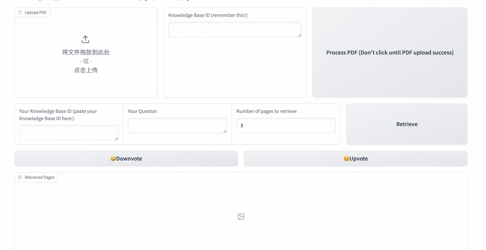

#  MiniCPM-V 系列模型在多模态文档 RAG 中的应用

在相当长一段时间内，检索增强生成（RAG）需要使用 OCR 技术把文档中的文本抽取出来，接着使用文本嵌入模型获得语义向量，利用语义向量构建知识库进行检索。这种方法，会丢失所有的图像信息、大部分表格信息、图表信息，存在不可避免的信息损失。

是否能够用一种近乎无损的方法来表征复杂图文文档，从而用来信息无损地检索多模态文档？

> 传统的图文检索方法包括 CLIP 模型和 SigLip 模型，这些模型在对比学习训练中或多或少获得了一些文档表征能力，但由于先天的结构设计问题，这些模型并不能很好地处理信息密度极高、语义极为复杂的文档，进而无法用作文档表示模型。

但以 GPT-4V, QwenVL, MiniCPM-V-2.0 等为代表的支持 OCR 能力的视觉语言模型，能够理解复杂的图文交错的文档，无论是文本密集型还是图像密集型文档，模型均借助视觉编码器的**视觉能力**和语言模型基座的**强大的文本功底**，形成良好的复杂文档理解能力。


那么，在这些支持 OCR 能力的模型上训练不需要 OCR 的向量检索模型，用来在**大量文档中**检索所需要的文档，就成为可能。


现在我们以 OpenBMB 基于 `MiniCPM-V-2.0` 训练的端到端多模态检索模型 [MiniCPM-Visual-Embedding-v0](https://huggingface.co/RhapsodyAI/minicpm-visual-embedding-v0) 为例，实现多模态检索。


> 若不熟悉代码或无GPU，本教程中的代码其实可以忽略，意会即可，笔者在huggingface上搭建了几个免费的demo可以给大家使用。

> 若不熟悉多模态信息检索也没有关系！本文的小标题非常容易follow。

## 多模态检索

### 配置环境

如果你是 Linux+英伟达GPU用户，在开始前，我们需要配置 MiniCPM-V 的运行环境。确保有 8GB 的显存。

首先应该创建一个空的环境，这里用的是 python 自带的 `venv` 库。

```bash
python -m venv visrag
```

创建一个空的 python 3.10 环境，然后进入这个环境:

```bash
source visrag/bin/activate
```

用 pip 安装下面的包：

```
PyMuPDF
tqdm
gradio
Pillow==10.1.0
sentencepiece==0.1.99
numpy==1.26.0
transformers==4.40.2
torch==2.1.2
torchvision==0.16.2
timm
```

然后需要安装 torch 和 torchvision，笔者喜欢从 pytorch 的官方镜像站 https://download.pytorch.org/whl/torch/ 下载，或通过普通的 pip 安装。


### 下载视觉检索模型

安装完成后，需要下载 `MiniCPM-Visual-Embedding-v0` 的模型权重。

这里我们从 huggingface 下载权重
```
pip install huggingface-hub
huggingface-cli download --resume-download RhapsodyAI/minicpm-visual-embedding-v0 --local-dir minicpm-visual-embedding-v0 --local-dir-use-symlinks False
```

如果是在国内，可以首先执行下面的代码再下载

```bash
export HF_ENDPOINT=https://hf-mirror.com
```

我们也在 modelscope 上提供下载：
```bash
pip install modelscope
modelscope download --model bxu2000/MiniCPM-Visual-Embedding-v0
```

等待几分钟后可以在当前目录下找到 `minicpm-visual-embedding-v0` 目录，模型已经下载完成。


### 加载模型

按照 [官方readme](https://huggingface.co/RhapsodyAI/minicpm-visual-embedding-v0) 里面的代码，这里需要把 `model_path` 改成刚刚下载的 `minicpm-visual-embedding-v0`的路径：

```python
model_path = './minicpm-visual-embedding-v0'
```


```python
from transformers import AutoModel
from transformers import AutoTokenizer
from PIL import Image
import torch

device = 'cuda:0'

# Load model, be sure to substitute `model_path` by your model path 
model_path = '/local/path/to/model'
tokenizer = AutoTokenizer.from_pretrained(model_path, trust_remote_code=True)
model = AutoModel.from_pretrained(model_path, trust_remote_code=True)
model.to(device)
```

### 最简单的例子：提一个问题，找出最相关的图像文档

这里提供了 3 张例子图片，分别是 `image1.png`，`image2.png`，`image3.png`，需要把路径分别替换进下面的代码。

这个代码实现的是模型的加载和一个最简单的检索。这里用户的问题是 `Who was elected as president of United States in 2020?`，同时提供了 3 张候选图片，其中有一张图片里的文档是能够回答这个问题的，其他的不能。

```python
# Load image to PIL.Image object
image_1 = Image.open('/local/path/to/images/memex.png').convert('RGB')
image_2 = Image.open('/local/path/to/images/us2020.png').convert('RGB')
image_3 = Image.open('/local/path/to/images/hard_negative.png').convert('RGB')

# User query
query_instruction = 'Represent this query for retrieving relavant document: '
query = 'Who was elected as president of United States in 2020?'
query_full = query_instruction + query

# Embed image documents
with torch.no_grad():
    p_reps = model(text=['', '', ''], image=[image_1, image_2, image_3], tokenizer=tokenizer).reps

# Embed text queries
with torch.no_grad():
    q_reps = model(text=[query_full], image=[None], tokenizer=tokenizer).reps # [B, s, d]

# Calculate similarities
scores = torch.matmul(q_reps, p_reps.T)
print(scores)
# tensor([[-0.0112,  0.3316,  0.2376]], device='cuda:0')
```

在这个代码中，我们需要首先对问题加上一个 prompt，这会告诉模型这是一个用户的问题：

```python
# User query
query_instruction = 'Represent this query for retrieving relavant document: '
query = 'Who was elected as president of United States in 2020?'
query_full = query_instruction + query
```

然后我们把文档和问题分别用训练好的视觉文档检索模型编码，如下：

```python
# 编码文档
with torch.no_grad():
    p_reps = model(text=['', '', ''], image=[image_1, image_2, image_3], tokenizer=tokenizer).reps
```

```python
# 编码问题
with torch.no_grad():
    q_reps = model(text=[query_full], image=[None], tokenizer=tokenizer).reps # [B, s, d]
```

然后需要对**问题**和**每一页文档**计算向量相似度：

```python
scores = torch.matmul(q_reps, p_reps.T)
print(scores)
```

这之后就能够知道哪个文档与这个问题的相关性最强，根据相似性取出 K 个文档作为检索结果。

可以看到输出的分数是：

```python
tensor([[-0.0112,  0.3316,  0.2376]], device='cuda:0')
```

这些分数表示了每个图像文档和问题直接的相似性：

*Image 1* 这是一个完全无关的文档。（得分-0.0112）


*Image 2* 这是能解决问题的文档。（得分0.3316）


*Image 3* 这是一个混淆项，它确实和 `president election of United States` 有关，但并不能解答用户的问题 `Who was elected as president of United States in 2020?`。（得分0.2376）


### 本地可部署的 Gradio Demo

像上面这样用代码做检索非常麻烦，笔者在 [MiniCPM_Visual_Document_Retriever_Demo](https://huggingface.co/spaces/bokesyo/MiniCPM_Visual_Document_Retriever_Demo) 的仓库里上传了一个可以本地部署的一个demo，这个demo可以对着一个很长的PDF问问题，检索最相关页面，可以很大程度节省阅读无关页面的时间。

唯一需要改的是 `model_path` 需要换成刚刚下载的 `minicpm-visual-embedding-v0` 的路径。然后需要通过 pip 安装 `gradio`。

```bash
pip install gradio
```

然后运行

```bash
python app.py
```

就会打开一个demo，可以对pdf提问题。



只需要在Upload PDF处上传一个PDF文件，点击 Process PDF 等待每一页被模型编码完成后，会得到一个知识库ID，这个ID会存在内存中，可以后续长时间使用。

之后，有了这个知识库ID就可以对PDF提问题了，这里的问题可以是陈述句也可以是问题，系统会返回最匹配的 K 个文档。

笔者以自己的一篇文章手稿为例，上传文章PDF并提了一个问题：


笔者认为，这个结果是相当不错的，笔者当时画这两张图确实是为了探究 `semantic stitching` 不是 `trivial` 的，看来模型对于图像的理解还是可以的。

### Huggingface 在线 Demo

即使没有GPU，也可以在 huggingface 的 space 上免费用这个 demo，不用本地部署，解放双手。[Huggingface Demo](https://huggingface.co/spaces/bokesyo/MiniCPM_Visual_Document_Retriever_Demo)。这个demo是笔者开的，用户可以免费用。


## 进阶：全流程多模态 RAG

至此，我们已经拿到了检索的最相关页面，但是阅读这些页面并回答也需要时间，这个情况在 MiniCPM-V-2.6 发布之前，要用 GPT-4V 的 api 来实现生成，但现在有了 MiniCPM-V-2.6 的强大的多图综合理解能力（其实笔者恰好参与了 MiniCPM-V-2.6 多图理解的训练，所以，笔者觉得是时候实现一下 RAG 的生成部分了！）

MiniCPM-V-2.6 将会根据这些文档图片来生成一个问题的答案。

### 下载 MiniCPM-V-2.6

我们可以用类似的方式下载 MiniCPM-V-2.6。

这里我们从 huggingface 下载权重：

```
huggingface-cli download --resume-download openbmb/MiniCPM-V-2_6 --local-dir MiniCPM-V-2_6 --local-dir-use-symlinks False
```

如果是在国内，可以首先执行下面的代码再下载

```bash
export HF_ENDPOINT=https://hf-mirror.com
```

等待几分钟后可以在当前目录下找到 `MiniCPM-V-2_6` 目录，模型已经下载完成。

### 安装 flash_attn

由于一些奇奇怪怪的原因必须用 `flash_attn` 这个库才能跑这个模型，所以呢我们需要手动安装。这里的版本很有可能安装不对，但解决方案是pip list看一下你的cublas版本和torch版本，去flash_attn release页面找一个条件合适的whl下载下来安装。如果安装成功了，那就基本没问题了。

- Release 页面
https://github.com/Dao-AILab/flash-attention/releases/

- 一个和笔者环境匹配的whl: https://github.com/Dao-AILab/flash-attention/releases/download/v2.6.2/flash_attn-2.6.2+cu123torch2.1cxx11abiFALSE-cp310-cp310-linux_x86_64.whl

whl下载下来之后，用 `pip install xxxx.whl` 就能安装。


### 加载 `MiniCPM-V-2.6`

按照官方给出的readme，把path替换为本地下载好的 `MiniCPM-V-2.6` 即可。

```python
import torch
from PIL import Image
from transformers import AutoModel, AutoTokenizer

model = AutoModel.from_pretrained('/path/to/MiniCPM-V-2_6', trust_remote_code=True,
    attn_implementation='sdpa', torch_dtype=torch.bfloat16) # sdpa or flash_attention_2, no eager
model = model.eval().cuda()
tokenizer = AutoTokenizer.from_pretrained('/path/to/MiniCPM-V-2_6', trust_remote_code=True)
```

### 把检索结果传给 `MiniCPM-V-2.6` 生成解答

这里是个例子：

```python
image1 = Image.open('image1.jpg').convert('RGB')
image2 = Image.open('image2.jpg').convert('RGB')
question = 'Compare image 1 and image 2, tell me about the differences between image 1 and image 2.'

msgs = [{'role': 'user', 'content': [question, image1, image2]}]

answer = model.chat(
    image=None,
    msgs=msgs,
    tokenizer=tokenizer
)
print(answer)
```

然后笔者搭建了一个huggingface demo，把这一套流程集成到了多模态检索流程中，就是说，在召回了多个候选图片文档后，会传给生成模型生成解答。这里笔者发现一个有趣的现象，可能也是必然，就是 这里用户的问题 `question` 最好能放在所有图片之前，这样我觉得模型能够有更多的「时间」来理解这个问题。实际试下来，发现问题在后的话，回答质量一般，但放在图片之前，就会好很多！

下面是笔者用自己搭建的 hf demo 检索-生成答案的一个例子：


> 在这个case中，笔者上传了一篇之前看过的paper，https://arxiv.org/abs/2402.09906 笔者把pdf上传到demo上，进行编码，笔者想考验一下这个系统能否正常工作，于是笔者就问了一下「如果对比学习中把文档的梯度停掉，不反向传播会怎样」，检索出的第一个页面就是笔者脑海中的那个，并且生成模型 MiniCPM-V-2.6 也很给力的把笔者想说的给说了，见生成的最后一句话。

好了，现在放上笔者的hf demo链接，有兴趣的小伙伴可以去试一下，和上面一样都是免费用的，如果想自己部署的话，把space里面的代码clone下来就可以在本地跑起来了，快去试试吧！

```bash
python app.py
```

demo链接奉上：https://huggingface.co/spaces/bokesyo/MiniCPMV-RAG-PDFQA

demo源代码：https://huggingface.co/spaces/bokesyo/MiniCPMV-RAG-PDFQA/tree/main


希望笔者可以给大家使用 MiniCPM-V 系列做多模态RAG带来一定的启发。


## 相关资源整理

1. MiniCPM-Visual-Embedding 多模态检索模型权重（huggingface）：https://huggingface.co/RhapsodyAI/minicpm-visual-embedding-v0

2. MiniCPM-Visual-Embedding 多模态检索模型权重（modelscope）：https://www.modelscope.cn/models/bxu2000/MiniCPM-Visual-Embedding-v0

3. MiniCPM-Visual-Embedding 多模态检索Demo（huggingface）：
https://huggingface.co/spaces/bokesyo/MiniCPM_Visual_Document_Retriever_Demo

4. MiniCPM-Visual-Embedding 多模态RAG Demo（huggingface）：
https://huggingface.co/spaces/bokesyo/MiniCPMV-RAG-PDFQA

5. MiniCPM-Visual-Embedding 训练框架（github）：
https://github.com/RhapsodyAILab/MiniCPM-V-Embedding-v0-Train

